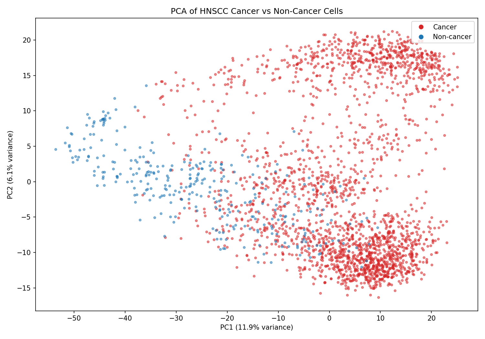
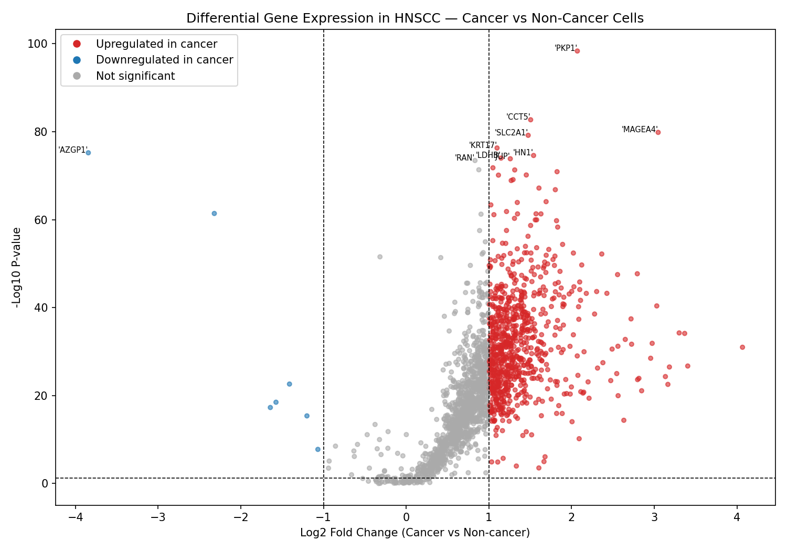
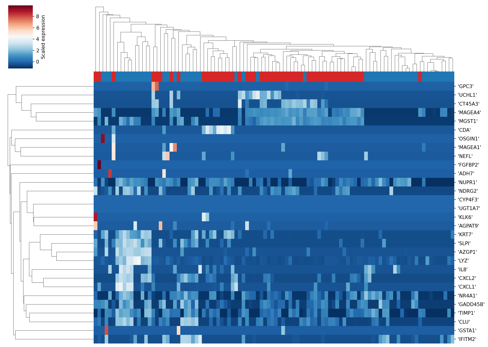

# HNSCC Single-Cell RNA-seq Analysis

Single-cell transcriptomic analysis of Head and Neck Squamous Cell Carcinoma (HNSCC) tumour microenvironment using the GSE103322 dataset (Puram et al., Science 2017).

## Overview

This project performs differential gene expression analysis between cancer and non-cancer cells in HNSCC tumours using single-cell RNA-seq data from 5,902 cells across 18 patients. The analysis identifies genes that distinguish malignant cells from stromal and immune populations within the tumour microenvironment.

## Dataset

- Source: GEO Accession GSE103322
- Publication: Puram et al., Science 2017
- Platform: Illumina NextSeq 500
- Cells: 5,902 single cells from HNSCC tumours
- Cancer cells: 2,215 | Non-cancer cells: 324

## Methods

- Quality filtering and metadata extraction from raw count matrix
- Selection of top 2,000 most variable genes
- Principal Component Analysis (PCA) for dimensionality reduction
- Mann-Whitney U test for differential expression between cancer and non-cancer cells
- Log2 fold change calculation with pseudocount normalisation
- Volcano plot visualisation of differentially expressed genes
- Hierarchical clustering heatmap of top 30 differentially expressed genes

## Tools and Libraries

- Python 3
- Pandas, NumPy, SciPy
- Scikit-learn (PCA, StandardScaler)
- Matplotlib, Seaborn

## Key Findings

**PCA** reveals clear separation between cancer and non-cancer cells along PC1 (11.9% variance explained), confirming distinct transcriptomic profiles between the two populations.

**Volcano plot** shows strong upregulation of known oncogenes in cancer cells including PKP1, SLC2A1, and MAGEA4, alongside significant downregulation of AZGP1 — consistent with published HNSCC literature.

**Heatmap** of top 30 differentially expressed genes demonstrates clear clustering of cancer vs non-cancer cells, with distinct expression signatures for immune markers (CXCL1, CXCL2) and epithelial markers (KRT7, GPC3).

## How to Run

1. Download GSE103322_HNSCC_all_data.txt.gz from GEO (accession GSE103322)
2. Open HNSCC_scRNAseq_Analysis.ipynb in Google Colab
3. Upload the data file when prompted
4. Run all cells sequentially

## Reference

Puram SV et al. Single-Cell Transcriptomic Analysis of Primary and Metastatic Tumor Ecosystems in Head and Neck Cancer. Cell. 2017;171(7):1611-1624.

---

**Author:** Zeel Vaghela

**Affiliation:** MSc Bioinformatics (Distinction), Teesside University, UK

**Data source:** GSE103322 via NCBI GEO

**Tools:** Python 3, Google Colab

**Contact:**
zjvaghela01@gmail.com
https://www.linkedin.com/in/zeel-vaghela
